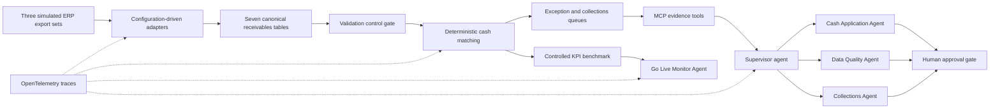

# O2C Deployment Workbench

A complete, clearly synthetic customer implementation for ERP receivables: source onboarding, canonical data, cash application, deductions, collections, controls, KPI benchmarking, MCP access, multi-agent exception review, observability, UAT, cutover, and hypercare.

> All SAP S/4HANA-style, Oracle Fusion-style, and NetSuite-style files in this repository are generated simulations. They are not genuine exports or live integrations. KPI movement is a controlled implementation benchmark on synthetic data, not customer impact.

## Why this is an implementation project

The workbench starts with customer configuration and three incompatible source layouts, not a clean analytics table. It applies validation gates, preserves payment residuals, routes exceptions, prioritizes collections, shows unmet targets, and produces the artifacts a deployment team would use from discovery through go-live.

The architecture deliberately keeps financial matching deterministic and auditable. Agents handle judgment-heavy work: exception investigation, data-quality diagnosis, collection planning, and go-live monitoring. They cannot post to an ERP, issue a refund, write off debt, or alter master data.



## Run it

```bash
python -m venv .venv
source .venv/bin/activate
pip install -e ".[dev]"
o2c-workbench --project-root .
streamlit run app.py
```

The reproducible seed-42 run creates 1,908 canonical records, detects 18 intentional duplicate bank transactions as warnings, and leaves zero validation errors. Open [the static dashboard](output/dashboard.html) or use the Streamlit app.

## MCP server

The server uses the current MCP Python SDK and exposes structured tools, resources, and prompts. Local clients should use `stdio`; deployed clients can use Streamable HTTP.

```bash
o2c-mcp --transport stdio
o2c-mcp --transport streamable-http --port 8000
```

Tools: `get_implementation_summary`, `investigate_payment`, `get_collection_priority`, and `run_controlled_benchmark`. Resources: `o2c://configuration`, `o2c://benchmark`, and `o2c://observability`.

## Multi-agent paths

The default path is offline and deterministic so a reviewer can reproduce handoffs and controls with no account or API key. It produces `output/agent_decisions.csv`, `output/agent_control_summary.json`, and OpenTelemetry spans.

An optional model-backed review uses the OpenAI Agents SDK with specialist handoffs and structured output:

```bash
pip install -e ".[ai]"
export OPENAI_API_KEY="..."
o2c-agent-review SAP-P001-09 --project-root .
```

The model path is intentionally not required for benchmark KPIs. It can recommend but cannot execute controlled financial actions.

## Repository map

- `config/` — implementation configuration, mappings, tolerances, weights, routes, controls, KPI targets, agent limits.
- `data/raw/` — generated, visibly labeled simulated ERP exports.
- `data/canonical/` — normalized customers, invoices, payments, remittances, deductions, promises, and activities.
- `src/o2c_workbench/` — adapters, matching, collections, controls, agents, MCP, observability, KPI logic.
- `output/` — benchmark evidence, queues, traces, and dashboards.
- `docs/` — process designs, mapping, controls, RTM, 28 UAT cases, cutover, monitoring, training, and research basis.
- `deliverables/` — implementation workbook.
- `demo/` — five-minute narrated implementation walkthrough and script.

## Seed-42 benchmark

| KPI | Current state | Configured future state | Movement |
|---|---:|---:|---:|
| Auto-match rate | 10.0% | 80.7% | +70.7 pp |
| Manual-review rate | 90.3% | 21.9% | -68.5 pp |
| Unapplied cash | $2,192,667 | $550,209 | -$1,642,459 |
| DSO | 115.9 days | 51.6 days | -64.3 days |
| CEI | 8.7% | 75.7% | +67.0 pp |
| Past-due AR | 69.5% | 44.9% | -24.6 pp |
| Processing time | 67.7 hours | 13.0 hours | -54.7 hours |

Four stretch targets remain unmet, so the monitor recommends a **conditional go**, not a victory lap. That is intentional implementation realism: proceed only with human approval controls and focused hypercare for unapplied cash and residual overpayments.

## Verification

```bash
pytest -q
```

See [research basis](docs/research_basis.md) for the primary sources that informed the payment cases, MCP transport choice, agent handoffs, and telemetry conventions.

