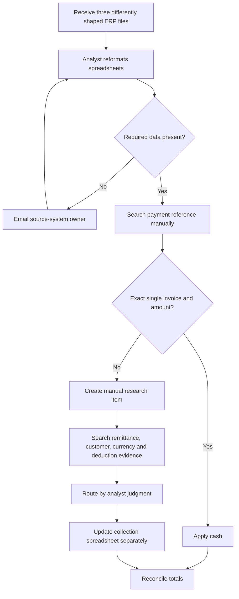

# Current-state process

Controlled baseline for Northstar Industrial Distribution (Synthetic), as of 2026-07-31.

Baseline symptoms evidenced by the seed-42 benchmark:

- 90.3% manual-review rate and $2.19M unapplied cash.
- 69.5% of ending AR past due and 54 broken promises to pay.
- 18 intentional duplicate bank transactions found during control checks.
- 67.7 estimated processing hours under configured baseline handling assumptions.

These are synthetic current-state conditions for a controlled implementation benchmark.

