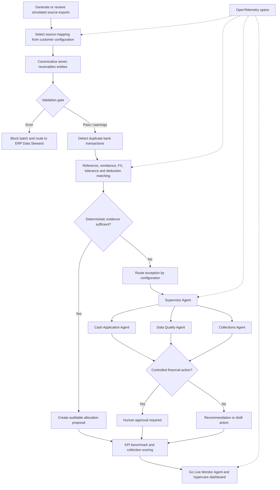

# Future-state workflow

```mermaid
flowchart TD
    A["Generate or receive simulated source exports"] --> B["Select source mapping from customer configuration"]
    B --> C["Canonicalize seven receivables entities"]
    C --> D{"Validation gate"}
    D -- Error --> E["Block batch and route to ERP Data Steward"]
    D -- Pass / warnings --> F["Detect duplicate bank transactions"]
    F --> G["Reference, remittance, FX, tolerance and deduction matching"]
    G --> H{"Deterministic evidence sufficient?"}
    H -- Yes --> I["Create auditable allocation proposal"]
    H -- No --> J["Route exception by configuration"]
    J --> K["Supervisor Agent"]
    K --> L["Cash Application Agent"]
    K --> M["Data Quality Agent"]
    K --> N["Collections Agent"]
    L --> O{"Controlled financial action?"}
    M --> O
    N --> O
    O -- Yes --> P["Human approval required"]
    O -- No --> Q["Recommendation or draft action"]
    I --> R["KPI benchmark and collection scoring"]
    P --> R
    Q --> R
    R --> S["Go Live Monitor Agent and hypercare dashboard"]
    T["OpenTelemetry spans"] -.-> B
    T -.-> G
    T -.-> K
    T -.-> S
```

Control principle: an agent may read, classify, route, and draft. It may not post to an ERP, write off debt, refund cash, or alter customer master data.

